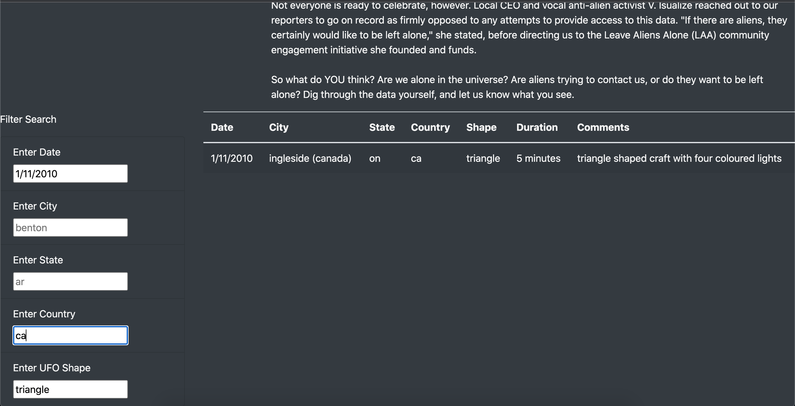

# UFOs
# Purpose 
-The purpose of this analysis is to provide a more in-depth analysis of UFO sightings by allowing users to filter for multiple criteria at the same time. This works by adding table filters for the City, State, Country and the Shape of the UFO itself (along with the date completed in the module).

# Results 
-Using this webpage is actually pretty simple. For a new user they can first look at the description of UFO sightings showing that something could be out there (in may different forms). 

### Web Page 

## Filter Through the Table 
-So like we did for the dates in the module, we can simply just add other criteria we would like to search for. In this case we can put the city as "la mesa" and the state as "ca" (for California). We just type the city and the state into their respective areas.

### Web Page (With Filters)

## Add More Filters
-If we would like to get even more specific, we can simply just enter the shape of the UFO itself that was sighted under the shape filter. In this case we can input "triangle" into the shape filter. We can also add a date we would like to see. Simply enter a date in the date filter like so.

### Web Page (With More Filters)

# Summary
Despite this web page showing specifics that can be helpful when search for certain criteria, I do think on of its drawbacks is that the data in the table is limited.
We are limited to the data of January of 2010. This vastly limits the search ability of the user where they are restricted to one month that was 10+ years ago. If the user is more interested in incidents that occurred (lets say in Roswell back in 1947), our table would not be able to help them since the data we used was for the year of 2010. Due to this, I believe gaining access to a larger set of data that has more dates (especially those in the past) can vastly improve the research capabilities of the web page. 
Another improvement I would make on the web page is to simply add more criteria to the table itself. For example, I would like to add a more specific index to the table (such as the time of day the sighting occurred). It can go well with the duration of the sighting especially since the durations on the table are all over the place. It would be interesting to know if these sightings happened during the day just as much as they happened at night.

# Resources
VS Code
HTML
JavaScript
