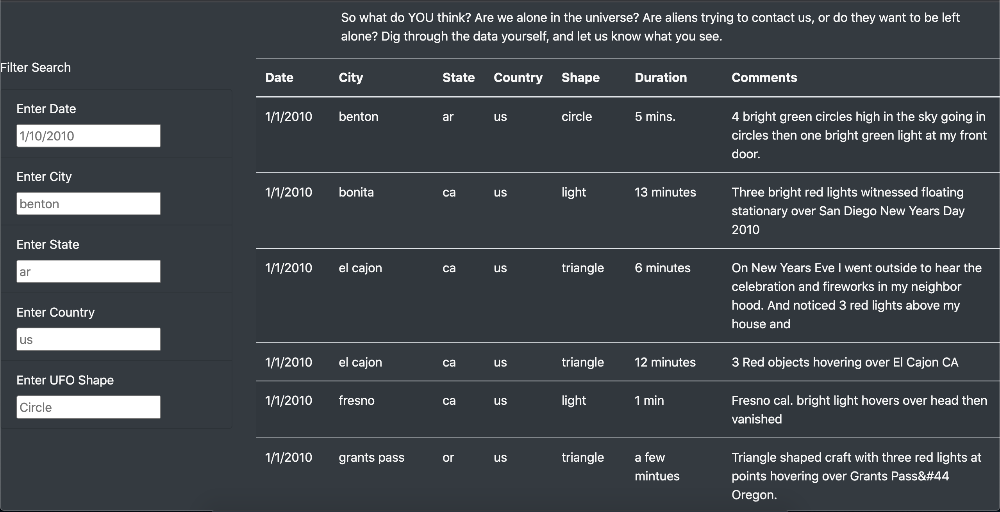
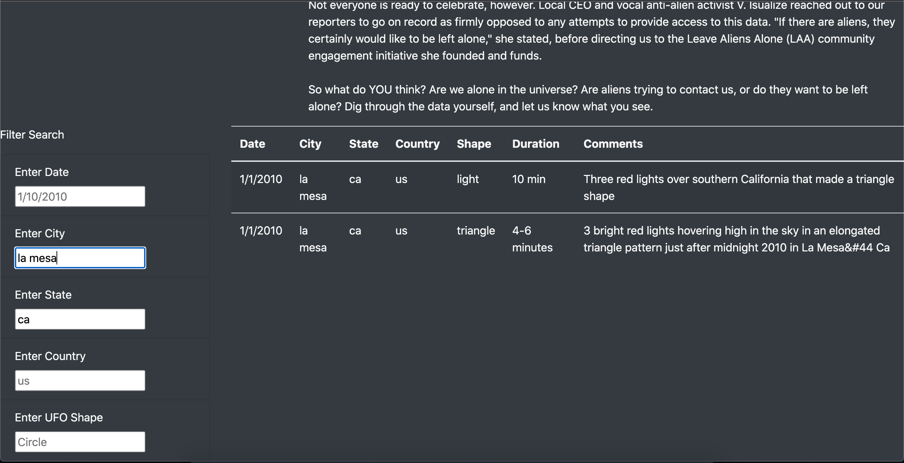

# UFOs
# Purpose 
-The purpose of this analysis is to provide a more in-depth analysis of UFO sightings by allowing users to filter for multiple criteria at the same time. This works by adding table filters for the City, State, Country and teh Shape of the UFO itself (along with the date completed in the module).

# Results 
-Using this webpage is actually pretty simple. For a new user they can first look at the description of UFO sightings showing that something could be out there (in may differnt forms). 

### Web Page 

## Filter Through the Table 
-So like we did for the dates in the module, we can simply just add other criteria we would like to search for. In this case we can put the city as "la mesa" and the state as "ca" (for California). We just type the city and the state into their respective areas.

### Web Page (With Filters)

## Add More Filters
-IF we would like to get even more sepcific, we can simply just enter the shape of the UFO itself that was sighted under the shape filter. In this case we can input "triangle" into the shape filter. We can also add a date we would like to see. Simply enter a date in the date filter like so.

### Web Page (With More Filters)

# Summary

# Resources
